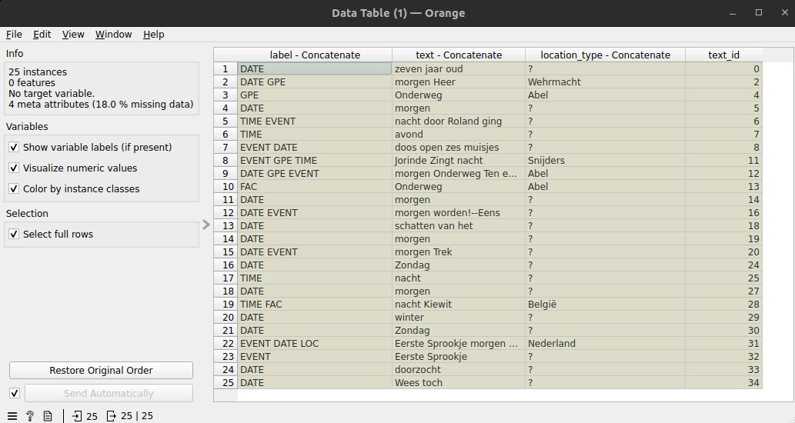

# Tutorial 5: Extracting story settings using the setting widget

---
This tutorial is part of a series demonstrating the use of StoryNavigator widgets. These tutorials show how to use StoryNavigator widgets with other pre-existing widgets available within the Orange platform, and how to generate output via tables or figures. Each tutorial addresses a research question related to the narrative structure and contents of the corpus of stories.
---

### Step 0: Research Question
In this tutorial, you will learn how to extract and analyze settings from stories in a corpus using the Setting widget. We will follow a predefined Orange workflow to answer the following research question:

How can we extract the most probable components of story settings such as time, place, and surroundings from a story corpus?

We use the following workflow:

This workflow can be downloaded [here](https://github.com/navigating-stories/orange-story-navigator/tree/master/doc/widgets/workflows), and it uses a dataset of Dutch fairytales which can be found [here](https://github.com/navigating-stories/orange-story-navigator/tree/master/doc/widgets/fairytales/).

### Step 1: Load the Corpus
To begin, load the corpus of stories from a folder using the Import Documents widget.

- Task: Load your dataset (stories)
- Outcome: You can visually inspect the texts with an extra Corpus Viewer.

### Step 2: Extract Story Elements
Next, use the Elements widget to extract the components of the story. The elements widget is the 'motor' of the StoryNavigator which provides information on the texts on a token level, while the actors widget is used to extract the agents from the text.

- Task: Extract story elements like characters and actions for further analysis.
- Outcome: You now have access to story elements that are relevant to understanding agency.

### Step 3: Setting Analysis
Now, connect the **Elements widget** to the **Setting widget**. The Setting widget focuses on identifying the key components of the setting, such as time (dates, time of day), places, and surroundings (locations, events). The widget helps identify the most probable setting elements based on their first occurrence in the text.

- Task: Highlight and extract information about time, location, and surroundings.
- Outcome: Probable settings for each story are extracted based on the most relevant keywords.

### Step 4: Inspect Data
Use the **Data Table widget** to inspect the dataset generated by the Setting widget. This table will contain relevant information about the extracted settings for each story.

- Task: Inspect the dataset to verify extracted settings.
- Outcome: You can confirm whether the widget accurately extracted setting components.

### Step 5: Select Rows
Next, connect the Data Table widget to the Select Rows widget. This allows you to filter out irrelevant information and select only the rows corresponding to the setting elements of interest.

- Task: Select the relevant rows that represent the setting for each story.
- Outcome: Filtered rows containing only the relevant setting data.

### Step 6: Group by Story ID
Use the **Group By widget** to group the data by story ID. This step ensures that each setting is tied to the specific story it belongs to. The chosen aggregated values for label and text need to be 'concatenate'.

- Task: Group the extracted settings by story ID.
- Outcome: A consolidated view of the setting per story.

### Step 7: Final Data Inspection
Finally, use the Data Table widget to inspect the overall settings for each story in the corpus.

- Task: Inspect the final dataset.
- Outcome: You will have a complete table of the overall settings extracted from the corpus, with one entry per story.

### Conclusion
By following these steps, you can extract and analyze story settings such as time, place, and surroundings from a corpus using the **Setting widget** in Orange. This will help you study how various elements of the setting are distributed across stories, enhancing your understanding of the narrative environment. 

You can further analyze these settings to identify patterns, trends, or correlations within the corpus, providing valuable insights into the narrative structure of the stories.

In another tutorial (number 7), we show how to complement this setting analysis with a deeper exploration of the setting using the **ChatGPT widgets**. Stay tuned for more insights into the narrative structure of your story corpus! 