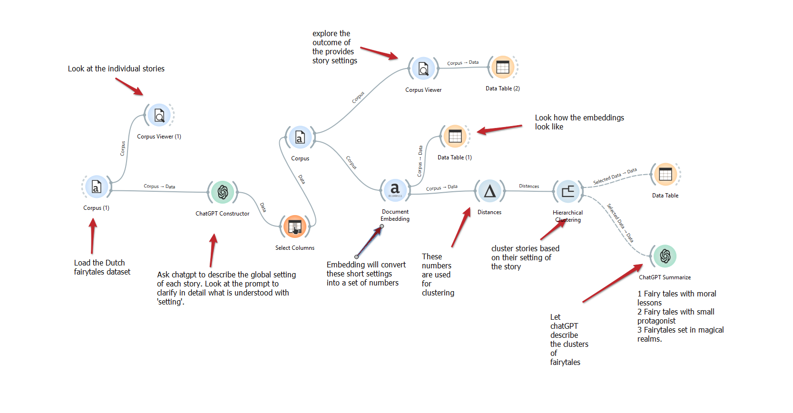
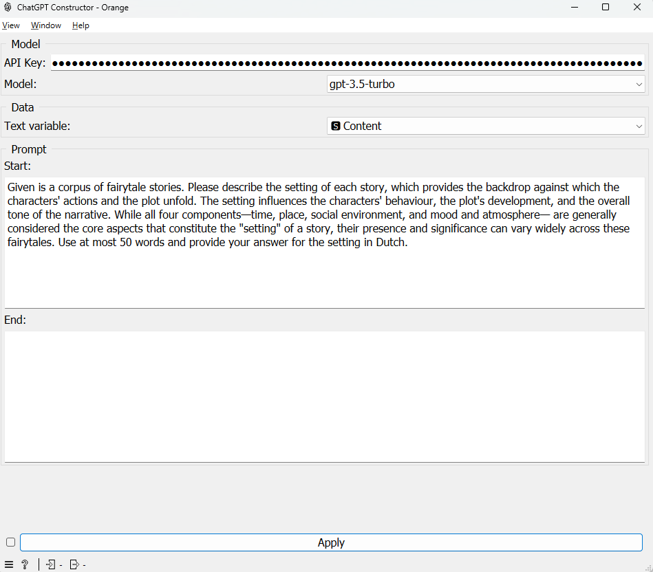
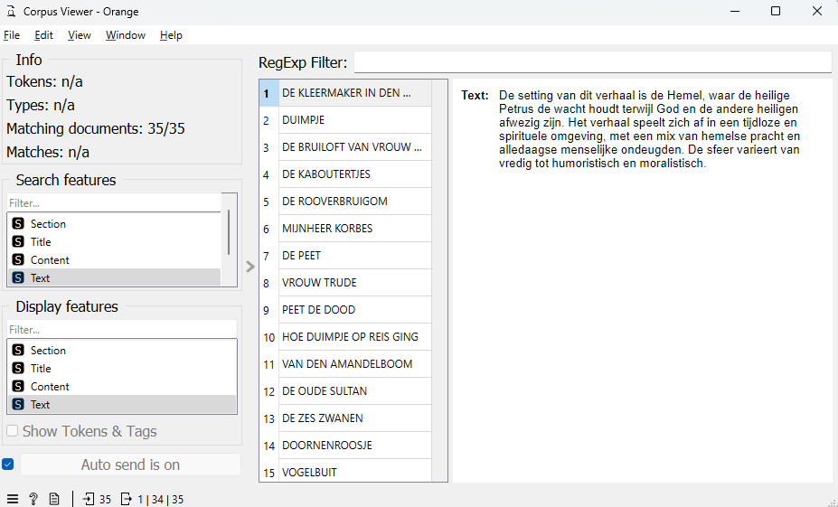
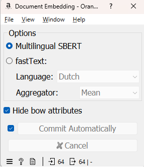
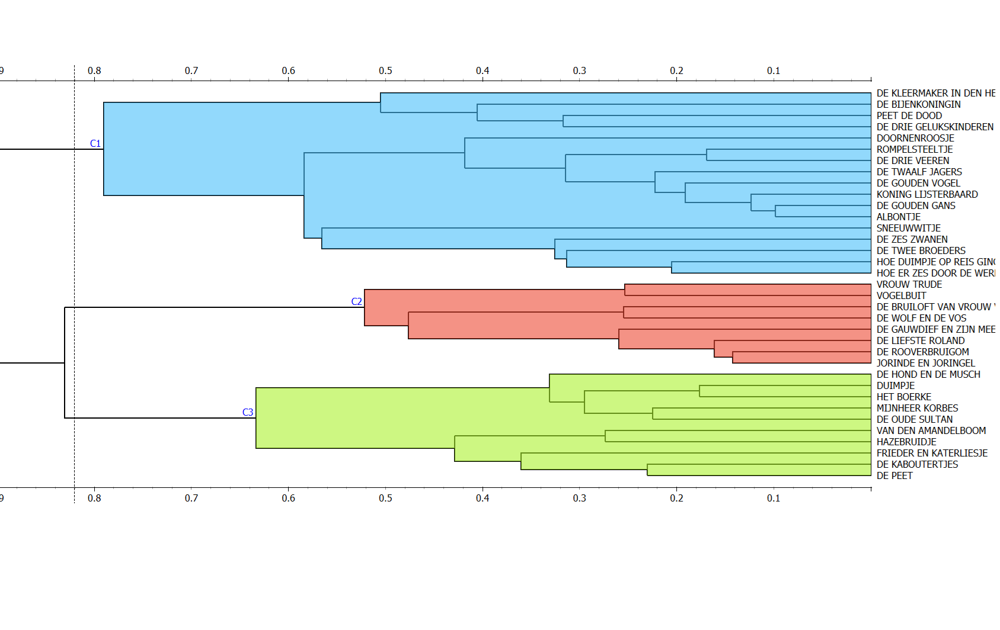
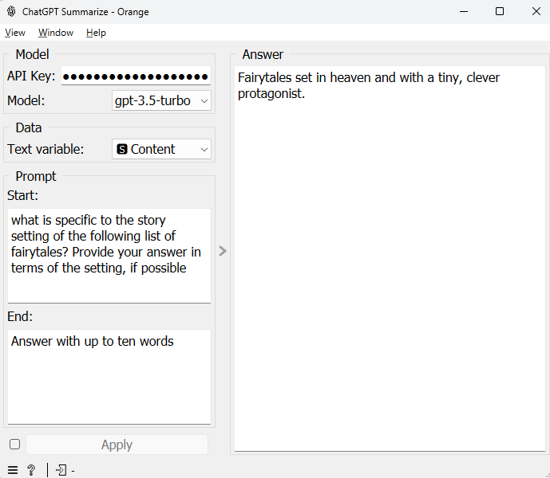

# Tutorial 7: Clustering fairytales based on story settings

---
This tutorial is part of a series demonstrating the use of StoryNavigator widgets. These tutorials show how to use StoryNavigator widgets with other pre-existing widgets available within the Orange platform, and how to generate output via tables or figures. Each tutorial addresses a research question related to the narrative structure and contents of the corpus of stories.
---

### Step 0: Research Question
In this detailed tutorial, we will guide you through a comprehensive workflow using the Orange data mining platform to cluster a corpus of Dutch fairytales based on their story settings. This process employs multiple Orange widgets, including ChatGPT integration, to achieve meaningful narrative clustering. This tutorial is intended to show how AI can be used to complement the StoryNavigator tools by integrating chatGPT widgets in your workflow. We will answer the following research question:

- How can we group the fairytales based on their storysetting?

The workflow consists of three main steps:
1. Proper prompting
2. Description Embedding and Clustering
3. Summarization and Insights

We use the following workflow:

This workflow can be downloaded [here](../../doc/widgets/workflows/), and it uses a dataset of Dutch fairytales which can be found [here](../../doc/widgets/fairytales/).

### Step 1: Load the Corpus

Start with the **Corpus** widget to load the dataset containing Dutch fairytales.

- **Task:** Import the fairytales dataset.
- **Outcome:** A visual representation of the corpus in the **Corpus Viewer**, allowing individual story inspection.

### Step 2: Describe Story Settings

Integrate the **ChatGPT Constructor** widget to describe each story's setting. This widget will take an *input prompt* and generate detailed textual descriptions of the story setting in each fairytale. Note that we can use ChatGPT to operationalize Burke’s complete Pentad on the global story level. The prompt could then look like:

----
"Make an analysis of the following set of Dutch fairy tales based on Burke's dramatic pentad. Indicate:
1. who or what the main character is in the story
2. what the main action is that the main character performs in the story
3. In what context the story takes place: the time and the place
4. what the goal of the main character is in the story
5. what instrument or means the main character uses in the story to achieve the goal  
Be brief. Use no more than six words per answer. A motivation is not necessary. Give your answer in Dutch."
----

For this tutorial focusing specifically on the settings, we used the following prompt:

---
"Given is a corpus of fairytale stories. Please describe the setting of each story, which provides the backdrop against which the characters' actions and the plot unfold. The setting influences the characters' behaviour, the plot's development, and the overall tone of the narrative. While all four components—time, place, social environment, and mood and atmosphere— are generally considered the core aspects that constitute the "setting" of a story, their presence and significance can vary widely across these fairytales. Use at most 50 words and provide your answer for the setting in Dutch."

---
- **Task:** Use ChatGPT to generate a setting description for each story.
- **Outcome:** Enhanced dataset with a new text column representing each story’s setting.

And the output will look like this:

### Step 3: Convert setting-descriptions to embeddings

Use the **Document Embedding** widget to transform textual descriptions into numerical embeddings using a model like BERT.

- **Task:** Convert story descriptions into embeddings.
- **Outcome:** Numeric vectors representing stories, facilitating clustering.

### Step 4: Calculate distances and cluster

Now, calculate the distances between embeddings using the **Distances** widget. Choose *cosine distance for this task*. Next, feed these distances into the **Hierarchical Clustering** widget.

- **Task:** Compute pairwise similarities and perform hierarchical clustering.
- **Outcome:** Clusters of stories that share similar settings.

**Widget details:**
- **Distances:** Computes distance matrix based on selected distance measures.
- **Hierarchical Clustering:** Groups similar stories into clusters using methods like Ward linkage.

### Step 5: Summarize clusters with ChatGPT

Deploy the **ChatGPT Summarize** widget to generate summaries for each cluster, providing insights into shared themes or settings.

- **Task:** Summarize the common characteristics of each cluster.
- **Outcome:** Clear narrative of thematic clusters, offering insights like groupings:
  1. Fairy tales with moral lessons
  2. Fairy tales with small protagonists
  3. Magical settings

### Integration of ChatGPT

**ChatGPT Constructor** and **ChatGPT Summarize** allow for seamless integration of natural language processing and generation, enhancing narrative analysis by deriving and summarizing rich content descriptions, ensuring an interactive exploration process.

### Conclusion

By following these detailed steps, you successfully clustered and analyzed fairytales based on their settings, gaining a deeper understanding of the narratives. This tutorial exemplifies how to combine data mining techniques with advanced language models to derive meaningful insights into story corpora. The resulting clusters can be used to explore narrative structures, identify common themes, and gain insights into the narrative content of the stories. Finally, the ChatGPT widgets can be integrated with the StoryNavigator widgets to enhance narrative analysis and storytelling research. But that will be the subject of another tutorial.