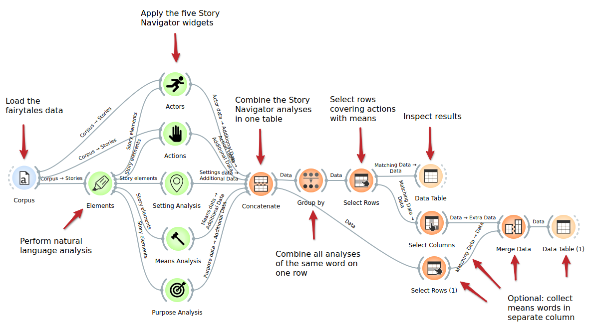
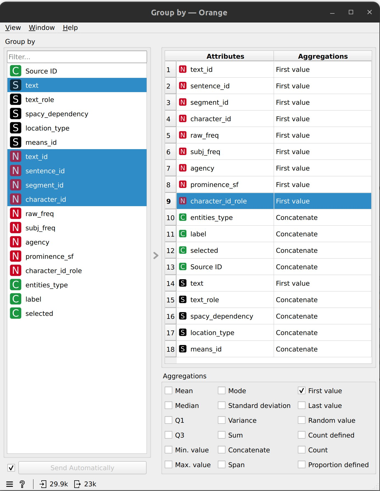
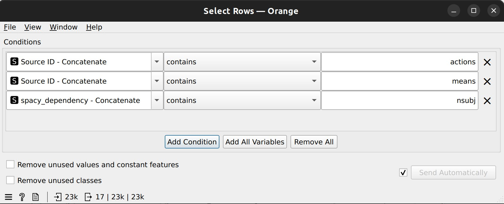
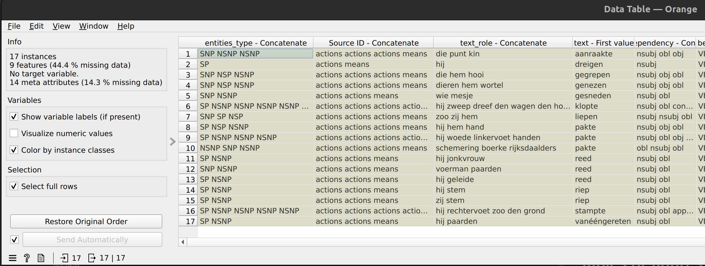

# Tutorial 8: Combining widgets from the Story Navigator

---
This tutorial is part of a series demonstrating the use of StoryNavigator widgets. These tutorials show how to use StoryNavigator widgets with other pre-existing widgets available within the Orange platform, and how to generate output via tables or figures. Each tutorial addresses a research question related to the narrative structure and contents of the corpus of stories.
---

### Research Question

In this tutorial, we will try to answer a research question which requires the results of multiple Story Navigator widgets. The research question is:

- What actors are related to actions that make use of a means?

For this purpose, we will combine the analyses of the Story Navigator in a single table and then extract the required results from this table with widgets from the Orange module group Transform.

We use the following workflow:

This workflow can be downloaded [here](https://github.com/navigating-stories/orange-story-navigator/tree/master/doc/widgets/workflows), and it uses a dataset of Dutch fairytales which can be found [here](https://github.com/navigating-stories/orange-story-navigator/tree/master/doc/widgets/fairytales/).

### Step 1: Load the data with the Corpus widget

The workflow starts with the **Corpus** widget. It loads the dataset containing Dutch fairytales. No action needs to be taken here unless you want to change the input text collection of the workflow.

### Step 2: Perform language analysis with the Elements widget

Next, the **Elements** widget needs to perform the language analysis on the dataset:

1. Open the Elements widget by double-clicking on the widget icon
2. Make sure that the right language is selected ('nl' for the fairytales dataset)
3. Verify that the number of segments of each story is 1
4. Do not remove stopwords: this setting should be 'no'
5. Click on 'Extract story elements'

### Step 3: Perform language analysis with the five Story Navigator widgets

The language analysis generated by the Elements widget will be sent to the five core Story Navigator widgets: **Actors**, **Actions**, **Setting Analysis**, **Means Analysis** and **Purpose Analysis**. Note that the Actors and the Action widgets need to be connected to the Corpus widgets while this is not necessary for the other three widgets. The five widgets will automatically start processing the data when received. This process will take several minutes to complete, depending on the speed of your computer.

### Step 4: Concatenate the analyses with the Concatenate widget

Next, the analyses from the five widgets are combined in a single table by Orange's **Concatenate** widget. If you want to see what is in this table, you can link an extra Data Table to the output of the Concatenate widget. The five widgets' output tables have five columns in common: 

- text: the relevant phrase that was analyzed
- text_id: the number of the story containing the phrase in the text collection
- segment_id: the number of the segment containing the phrase
- sentence_id: the number of the sentence containing the phrase
- character_id: the position of the first character of the phrase in that sentence

Some widgets have extra columns which are also included in the combined table. These columns do not contain values for the other widgets (marked by '?').

The names of the five widgets will appear in a new output column of the Concatenate widget: Source ID. This makes it possible to later check which widget generated which row in the combined table.

### Step 5: Combine analyses with the Group By widget

Our research question is to find out what actors are related to actions that make use of a means. Both the Actions widget and Means Analysis widget identify actions. In this step we use the Orange's **Group By** widget to combine all analyses of phrases by different widgets on single rows.

For example: if the Actions widget and the Means Widget have both analyzed the verb 'aanraakte', this verb will appear on two rows in the combined table, once for each widget. In this step, the Group By widget will combine these two rows on a single row. A new column 'Source ID - Concatenated' will contain the names of the widgets involved in the combined row, here 'actions means'. A widget name can appear more than one time in this column, if the widget generated more than one analysis for the phrase.

Since the same phrase may appear in multiple places in the texts, we also check the relevant ids of the text, segment, sentence and first character before making combinations.

In order to avoid the workflow becoming more complex, we refrain from involving the analysis of the Actors widget in this step. 

### Step 6: Select relevant rows

Now the **Select Rows** widget can be used for selecting the information we are interested in: rows containing both `action` and `means` in the `Source ID - Concatenated` column and `nsubj`, the tag for sentence subject, in the column `spacy_dependency - Concatenated`. 

The results can be inspected in the next **Data Table** widget (double-click on the widget): the workflow found 17 verbs with both a subject and a means. The subjects can be found in the column `text_role - Concatenate`. In general, the first word in each cell is the subject but there is one exception where the subject is the second word (text 23, sentence 35). The exception can be identified by the order of the labels in column `spacy_dependency - Concatenated`.

### Step 7: Prepare data for merging

Optional: currently the required subject words appear in a column next to other words. We can achieve having them in a column by their own by merging the results of the Select Rows widget with the results of the Concatenate widget. However, Orange is a bit picky about merging information which includes duplicates and therefor we first need to remove irrelevant information before making the merge.

In this step we use the **Select Columns** widget to select the columns specifying our results (four position columns and `means_id Concatenated`) and we apply the **Select Rows** widget for retrieving the nsubj rows from the Concatenate widget.

### Step 8: Merge

The two selected results can now be merged with Orange's **Merge** widget. The results can be inspected with the following **Data Table**. The subjects can be found in the column `text_role`. Note that we have lost the exception from text 23. Retrieving this one as well will probably require writing task-specific Python code. 

### Conclusion

The Story Navigator widgets can jointly be applied to the same texts and there analyses can be combined with the general Orange widgets, as shown in this tutorial. This approach enables complex analyses of texts. However more complicated inquiries may require using Orange's **Python Script** widget in combination with task-specific programming. 